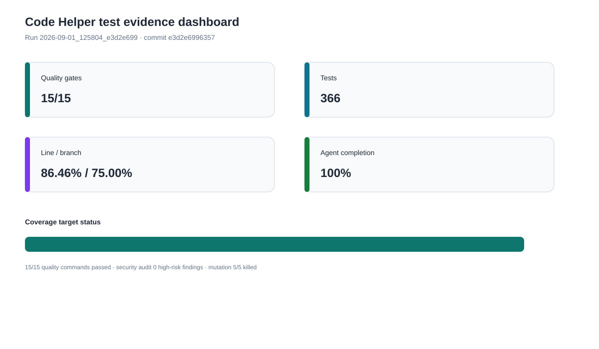
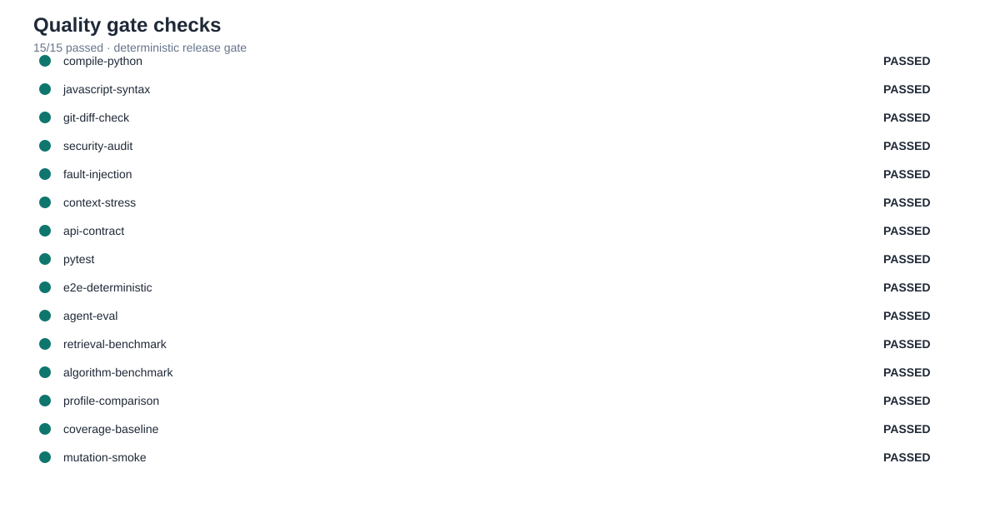
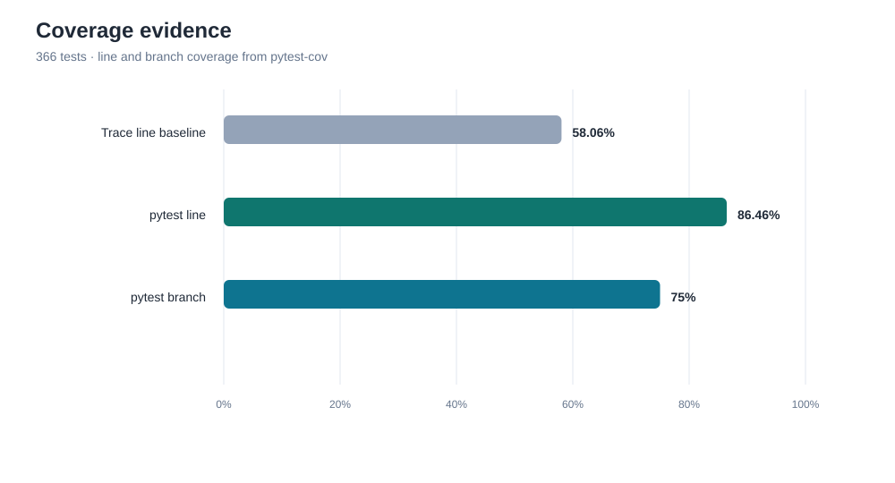
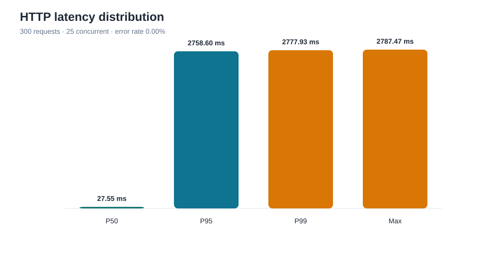
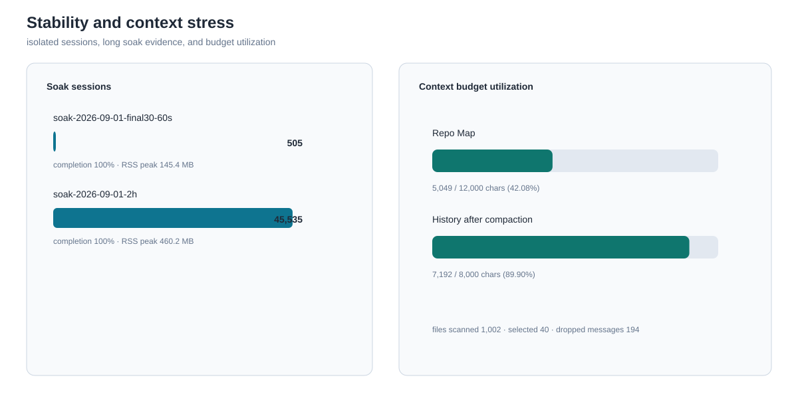
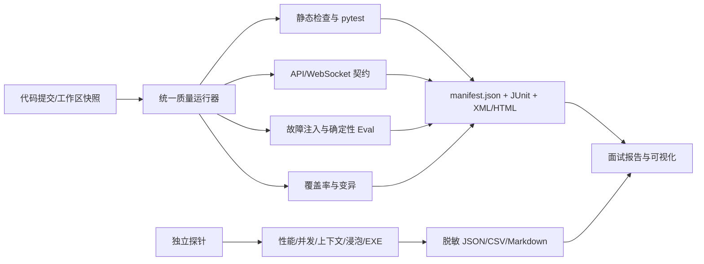

# Code Helper 全面测试实践：面试说明稿

> 用途：面试中解释“如何开展测试、做了哪些测试、效果如何”。
> 
> 数据来源：`2026-09-01_125804_e3d2e699` 确定性质量门禁及其配套探针。所有指标均来自脱敏 JSON/XML，不包含 API Key 或用户文件内容。

## 一句话介绍

我没有只用一次成功对话来证明 Agent 可用，而是按风险建立了从静态检查、单元测试、协议集成、用户旅程、压力稳定性到 Agent 能力评估的分层测试体系；测试结果绑定 Git 提交、环境和原始证据，因此可以复现，也能区分代码缺陷、模型波动和外部服务问题。

## 1. 背景与测试目标

Code Helper 是一个带 Web UI 和 Windows EXE 的本地 Coding Agent，包含 Agent Loop、文件和命令 Tools、审批策略、上下文压缩、Repo Map、记忆、算法实验室、WebSocket 流式事件和会话持久化。它的风险不只是“函数算错”，还包括：

- Agent 可能无限循环、Step 耗尽或停止后无法恢复；
- Tool Call 与 Tool Result 不配对，导致模型 API 返回 400；
- Ask/Plan/Act 或审批策略被绕过，误写文件或执行危险命令；
- 大仓库和长历史挤爆上下文，旧消息被重复流式播放；
- 多会话事件串扰、取消竞态、WebSocket 断线丢事件；
- EXE 缺资源、路径边界失效、API Key 出现在日志中。

所以测试目标被拆成四个问题：

1. 核心逻辑和状态转移是否正确？
2. 接口、权限、持久化和用户流程是否稳定？
3. 并发、大上下文、长时间运行和打包后是否可靠？
4. Agent 的任务完成和代码验证能力能否用可重复数据说明？

## 2. 测试策略：风险优先的测试金字塔

| 层级 | 关注点 | 主要手段 | 结果 |
| --- | --- | --- | --- |
| 静态质量 | 语法、编译、空白、敏感信息 | `compileall`、`node --check`、`git diff --check`、安全审计 | 全部通过；安全审计 0 个高危发现 |
| 单元测试 | Agent Loop、预算、权限、Tools、上下文、记忆、算法、前端辅助逻辑 | pytest 参数化和边界测试 | 366 passed |
| 集成/契约 | FastAPI、WebSocket、会话隔离、审批状态码和事件顺序 | ScriptedModel + TestClient | 32/32 checks |
| 端到端 | Ask→Act、审批、验证、归档/恢复、重启恢复 | 确定性 E2E 脚本 | 通过，模型调用 4 次 |
| 能力 Eval | 检索、完成、安全、验证、算法 Profile | 固定任务集 + 结构化评分 | 11 个任务，各项硬指标 100% |
| 非功能 | 延迟、并发、上下文规模、长时资源 | HTTP、并发、上下文和浸泡探针 | 成功率 100%；尾延迟和 RSS 风险被记录 |
| 发行与用户级 | EXE 冷启动、UI 控件、文件预览、恢复 | PyInstaller 检查 + 浏览器烟测 | 包检查通过；部分人工流程待补 |

### 测试证据总览



这张图适合面试开场展示：15 项质量命令全部通过、366 个测试、86.46% 行覆盖率/75.00% 分支覆盖率、确定性并发完成率 100%。

## 3. 实测结果

### 3.1 质量门禁和覆盖率

- 统一 Run ID：`2026-09-01_125804_e3d2e699`。
- 被测提交：`e3d2e69963577a1ee875d22a66d2c338c6d926c1`。
- 工作区快照：`b968c94616e832ed9f359cf67ae0752d3f7745b6f4c6e3f7167916118954cb36`。
- 环境：Windows 11、Python 3.13、16 个逻辑 CPU。
- 质量门禁：15/15 通过，0 失败，0 跳过。
- pytest：366 passed。
- pytest-cov：行覆盖率 86.46%，分支覆盖率 75.00%。
- 标准库 `trace` 基线：12,751 条可执行行中覆盖 7,403 条，58.06%。
- 关键不变量变异：5/5 killed，Mutation Score 100%。
- 安全审计：未发现被跟踪的 `.env`、密钥模式或高危隐私路径。





覆盖率使用两套工具：`pytest-cov` 用于 CI 的 XML/HTML 和分支分析，标准库 `trace` 用于没有可选依赖的干净环境。这样既有工程门禁，也有环境独立的基线。

### 3.2 单元和集成测试覆盖内容

测试不是简单堆数量，而是围绕状态和边界组织：

- Agent Loop：文本终止、Tool Call 循环、Step/Token/时间预算、取消、异常恢复和重复动作保护。
- 协议可靠性：流式 Tool Call 参数错误时回退非流式请求；每个 `tool_call_id` 都有对应 Tool Result。
- 权限：Ask、Plan、Act 与请求批准、帮我批准、完全放开三种策略；工作区外路径和高风险命令始终受硬边界保护。
- 文件/命令/Git：Unicode 路径、空文件、大输出裁剪、超时、取消、重复 Patch、未初始化仓库和 Checkpoint。
- 上下文：字符预算、历史摘要、协议消息完整性、Repo Map 选择、文件摘要缓存命中和外部修改失效。
- 记忆/Skills/Hooks：候选确认、项目隔离、重复合并、按需加载、Hook 顺序和失败隔离。
- 算法实验室：约束解析、固定种子、Oracle 对拍、超时/编译失败/输出格式错误和最小反例。

### 3.3 API、WebSocket 和确定性 E2E

契约探针验证了 32 项 HTTP/WebSocket 行为，包括：

- 健康、设置、会话创建/列表/详情和会话隔离；
- 嵌套文件读取、路径越界、模式/推理/审批切换；
- 非法审批载荷返回 422、无待审批返回 409；
- 轨迹、回放、上下文、记忆、权限、检查点和算法接口；
- WebSocket 历史事件、实时事件、断线重连后的历史补发和事件顺序。

确定性 E2E 使用临时工作区和 ScriptedModel，完成 Ask→Act、文件写入审批、验证命令审批、最终完成、归档/恢复以及重启历史恢复，避免把外部模型随机性混入基础回归。

### 3.4 压力、并发和上下文测试

| 场景 | 实测数据 | 说明 |
| --- | --- | --- |
| HTTP 只读负载 | 300 请求 / 25 并发，错误率 0%，吞吐 96.195 req/s，P50 27.550ms，P95 2758.599ms，P99 2777.927ms | 发现并保留尾延迟抖动，不把健康接口结果当成模型吞吐 |
| Agent 并发 | 20 会话 / 5 并发，完成率 100%，事件串扰 0，7.224 sessions/s | 每个会话使用临时工作区，验证隔离 |
| 大上下文 | 1,002 个文件、200 条历史消息；Repo Map 冷/热 8.993s/2.352s | 历史压缩后 7,192/8,000 chars，缓存失效通过 |
| 60 秒浸泡 | 505 会话，0 失败，RSS 峰值约 152.5MB | 中时基线 |
| 2 小时浸泡 | 45,535 会话，0 失败，事件串扰 0，RSS 峰值约 460.2MB | 历史快照；资源风险保留，不直接判定泄漏 |





### 3.5 EXE 和 UI 验收

- PyInstaller onedir 包检查通过，包含 1,806 个文件。
- EXE 大小约 14.8MB，SHA-256 已记录。
- 冷启动探针约 1.49 秒后健康接口返回 HTTP 200，探针结束后进程清理完成。
- 浏览器烟测已验证工作区恢复、模式/推理/任务切换、归档/恢复、四个标签、输入框自适应、文件浏览、Markdown/代码高亮和刷新恢复。

EXE 包结构和浏览器烟测仍不能替代干净 Windows 安装、WebView2 多轮对话、真实审批/取消和人工复制操作；这些项目在报告中单独列为待验收，而不是标记为已完成。

## 4. 缺陷驱动的测试闭环

面试中最能证明测试能力的不是“全绿”，而是测试确实发现过问题并推动修复：

| 发现 | 根因 | 修复/回归 |
| --- | --- | --- |
| 检查点接口返回 500 | 局部变量遮蔽 `checkpoint_manager`，读取会话前引用了错误对象 | 修复变量命名；API 契约 32/32 重新通过 |
| 审批接口出现 422 | 审批字段类型过于宽松，非法载荷未形成稳定契约 | 收紧为严格布尔字段；新增 422/409 回归 |
| 长输出取消后完整结果引用丢失 | Windows 管道关闭竞态，已读取内容未被保留 | 保留部分输出并写入结果引用；故障注入和取消测试通过 |
| 流式 Tool Call 导致模型协议错误 | 流式参数不完整时直接终止任务 | 增加一次非流式恢复；故障注入验证安全收敛 |
| 高负载下测试偶发卡住 | 测试夹具寿命和并发耗时阈值产生竞态 | 延长子进程寿命、直接验证并发重叠；最终门禁通过 |

我的处理方式是：保留失败日志和最小复现 → 定位根因 → 修复 → 添加回归用例 → 重新跑完整门禁。失败证据不被删除，也不被“全绿”结果掩盖。

## 5. 自动化是如何实现的



关键设计点：

1. **确定性模型替身**：基础回归使用 ScriptedModel，固定 Tool Calls 和响应，避免 API 费用与随机性。
2. **统一证据元数据**：每个探针记录 Run ID、Git Commit、工作区快照、环境和耗时；不记录密钥与文件正文。
3. **分层门禁**：PR 运行快速单元/契约检查，主分支运行完整 Eval，发布前再运行压力、EXE 和人工验收。
4. **失败可解释**：状态码、事件序列、最小反例、覆盖率缺口和资源曲线都保留原始证据。
5. **可重复图表**：`scripts/generate_test_visuals.py` 读取 JSON/XML 自动生成 SVG，报告不依赖手工复制数据。

## 6. 面试回答模板

### 30 秒版本

> 这是一个本地 Coding Agent，我按风险而不是按页面数量设计测试。底层用 366 个 pytest 验证 Agent Loop、权限、预算、工具协议和上下文；接口层用 32 项 HTTP/WebSocket 契约和确定性 E2E 验证审批、取消、重连和重启恢复；非功能层做了 20 会话并发、1000 文件上下文、60 秒和 2 小时浸泡；能力层用 11 个固定任务评估检索、完成、安全和验证率。最终 15 项门禁全部通过，行/分支覆盖率为 86.46%/75%，但我也保留了 P95 尾延迟和 RSS 峰值这类风险，没有把“全绿”当成没有问题。

### 90 秒版本

> 我先把系统拆成 Agent Loop、Tools、权限、上下文记忆、WebSocket、UI 和桌面打包几个风险域。每个风险域先写确定性单元和契约测试，再用用户旅程和压力测试验证组合行为。为了避免 DeepSeek 的随机输出影响回归，我实现了 ScriptedModel 和统一质量运行器，运行器会把命令、环境、提交哈希和结果写进 manifest。测试中曾经发现检查点变量遮蔽、审批 422、Windows 长输出取消竞态和流式 Tool Call 协议错误，我都按“失败证据—根因—修复—回归”闭环处理。当前 366 个测试和 15 项门禁通过，变异测试 5/5 被捕获，并发无事件串扰；同时 HTTP P95 和长时 RSS 仍被标为风险。真实 DeepSeek、干净 Windows 和完整 WebView2 还需要在外部环境补验，这样测试结论是可信的。

### 被追问“为什么不用一次真实模型演示？”

> 真实模型适合验证开放域任务质量，但不适合做每次提交的稳定回归。我的做法是把协议、权限、状态和工具边界用确定性测试锁住，再单独安排小规模 DeepSeek Eval，记录首 Token、P95、429、取消和费用。这样能区分“代码回归”和“供应商波动”。

### 被追问“P95 很高是不是测试失败？”

> 这次 HTTP 健康接口错误率是 0%，但 P95 为 2.76 秒、P99 为 2.78 秒，所以我不会把它说成性能通过，而是记录为尾延迟风险。这个探针没有调用模型，下一步会在空闲机器重复多轮，并加入会话列表和文件列表混合流量，再决定是系统调度抖动还是服务端排队。

## 7. 当前结论与待补验

当前确定性质量结论：**Conditional Pass**。

已完成并有证据：

- 单元、集成、契约、确定性 E2E、并发、上下文压力、安全审计、故障注入、变异测试和 EXE 包检查。
- 366 个测试通过，15/15 统一门禁通过。
- 图表和数据快照由脚本自动生成，报告指标可追溯到原始 JSON/XML。

仍需外部环境补验：

- 真实 DeepSeek 小规模重复 Eval、费用和供应商限流；
- 干净 Windows 虚拟机中的安装/升级和残留进程；
- WebView2/浏览器完整多轮对话、审批、取消、刷新恢复、复制和响应式布局；
- 单个长生命周期服务的 RSS、句柄、线程和事件队列曲线；
- 完整 `mutmut`（当前使用项目内置变异探针，5/5 killed）；
- P0/P1 缺陷清单的正式关闭记录。

因此面试中的准确表述是：**“自动化和确定性测试体系已经落地并通过门禁，外部模型和发行环境验收仍按清单推进。”**

## 8. 复现命令和证据索引

在仓库根目录执行：

```powershell
# 完整确定性质量门禁
python scripts/run_quality_tests.py --include-evals --include-coverage --include-mutation --output-dir test-results/quality-run-2026-09-01-final39

# 从门禁和探针 JSON/XML 重新生成图片
python scripts/generate_test_visuals.py --output-dir docs/test-reports/visuals
```

主要证据：

- [统一门禁摘要](../test-results/quality-run-2026-09-01-final39/summary.md)
- [机器清单](../test-results/quality-run-2026-09-01-final39/manifest.json)
- [最终测试报告](final-test-report.md)
- [确定性质量报告](test-reports/2026-09-01-deterministic-quality.md)
- [覆盖率报告](test-reports/2026-09-01-coverage.md)
- [已知限制](test-reports/known-limitations.md)
- [可视化数据快照](test-reports/visuals/visual-data.json)
- [可视化索引](test-reports/visuals/README.md)

原始性能、并发、上下文和 EXE 报告位于 `test-results/`，该目录默认被 Git 忽略；面试交付时提交本报告、图表和脱敏汇总，按需提供原始 JSON/CSV。
